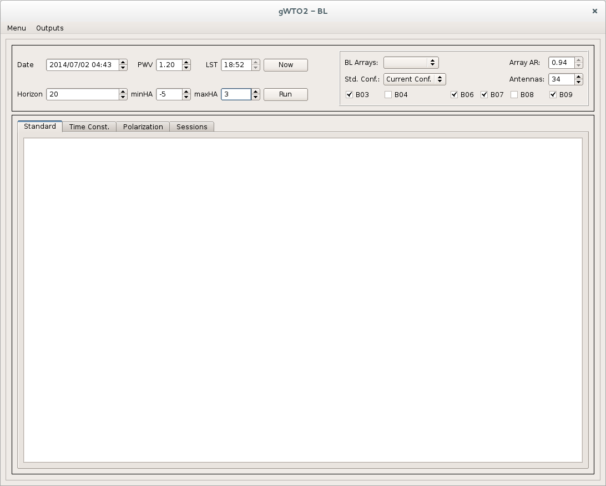
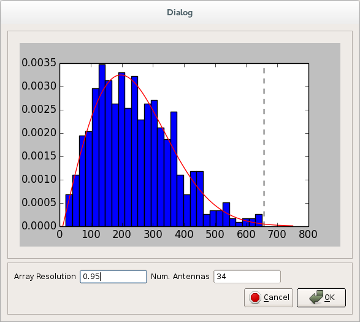
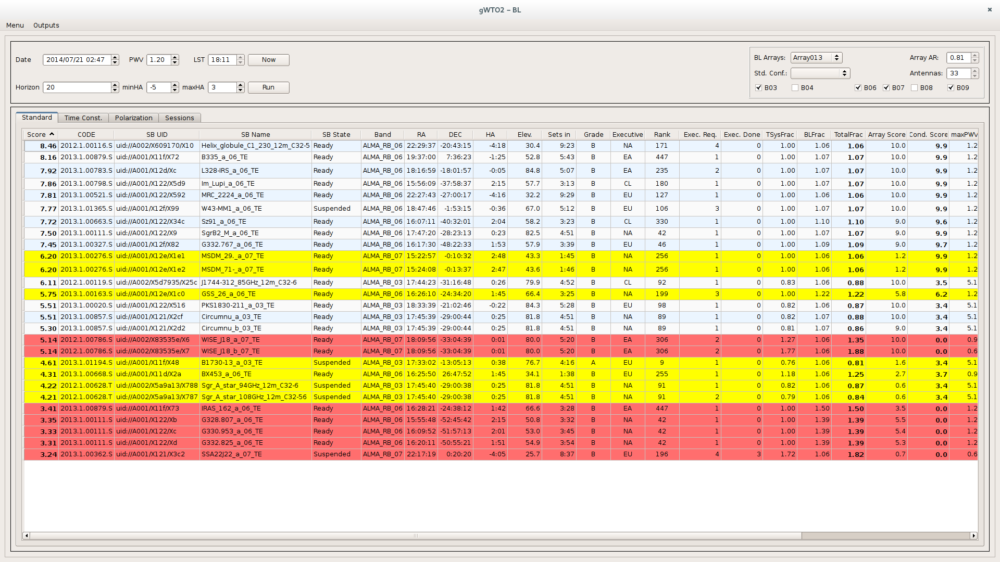

***********
Using gWTO2
***********

Starting the GUI
================

gWTO2 is tested and deployed at the **osf-red** machine, within the **aod** account.
A virtual environment of python, based on the
`Anaconda distribution <http://docs.continuum.io/anaconda/index.html>`_,
must be loaded before using it. This is achieved by running::

    . activateC2Test

The Anaconda distribution is based on python 2.7.6 and includes numpy, pandas,
pyephem and other libraries need by gWTO.

The gui is run executing the gWTO2.py comand::

    Usage: gWTO2.py arg1 [options]
        arg1 must be BL or ACA

    Options:
      -h, --help            show this help message and exit
      -c, --clean           Force clean up of gWTO2 cache
      -p PATH, --path=PATH  Path for cache

So, to run gWTO2 for baseline correlator use argument :option:`BL`, and
:option:`ACA` for Total Power and ACA. The :option:`-c` option should only be
used once per day.

I would also recommend to set the option :option:`-p` to something like
``'/.wto_myname/'`` so different users running gWTO won't mess up the cache
for each other. **After playing with gWTO2 using a different path, please**
**delete the directory created with the name .wto_myname**

The gWTO2 window
================

After starting :command:`gWTO2 BL` you will be presented with the gui shown on
:ref:`Figure 2 <fig2>`.
If the :option:`-c` option was used, or the cache have been manually erased it,
the time until the gui is ready can be up to 5-7 minutes.

.. _fig2:

   Figure 2

The gui for ACA (:command:`gWTO2 ACA`) is almost the same, except for the lack
of :guilabel:`Array Options`, and the presence of a tab :guilabel:`TP` that
will be used for handling Total Power SBs.

Setting up variables
====================

After opening, the :guilabel:`Date` will be by default the current UTC time,
:guilabel:`PWV` is set to 1.2 mm., the :guilabel:`Horizon` limit is 20 degrees,
:guilabel:`minHA`, minimum hour angle, is -5 and :guilabel:`maxHA`, maximum
hour angle, is 3. The :guilabel:`LST` field is not editable, and it shows the
LST for the date/time set in the :guilabel:`Date` field.

**(For BL GUI only.)**
   The box with the array variables will have the
   :guilabel:`Std. Conf.:` field set to :keyword:`Current Conf.`
   This :keyword:`Current Conf.` comes from the output of the CASA script
   :command:`arrayConfigurationTools.py`, which can be found at
   :file:`~/AIV/science/ArrayConfiguration/Tools/arrayConfigurationTools.py`.
   It is made with the antennas that in principle can be used for the current
   ES Block. **It is the AoD Lead's duty to create the relevant files from**
   **time to time to account for antenna movements or new antennas added**.
   :ref:`(Instructions) <current-conf>`

**(For BL GUI only.)**
   The values given at :guilabel:`Array AR:`  and :guilabel:`Antennas:`
   are set according to the *current array's* angular resolution and
   number of antennas offered officially for cycle 2.
   **The only field you can modify at this stage in the 'Antenna'**
   **field, which is the number of antennas**. The idea is that the user will use
   this information to have an idea of the current configuration characteristics,
   and to run gWTO2 to plan observations ahead of time, or when Baseline arrays
   have not been created in the last 6 to 12 hours.

**(For BL GUI only, when observing.)**
   The user should press the button :guilabel:`Now`, and a pop up window
   similar to the one shown in :ref:`Figure 3 <fig3>` will appear.

.. _fig3:

   Figure 3

The window show the normalized histogram of the baseline lengths, and a fit to
this distribution, taking the data from latest Baseline Array created.
From this distribution the array's resolution is estimated, and the number of
antennas is also show. **The user should check that the array resolution is**
**close the the "Current Conf." value, and that no outliers are fitted**. If
happy press the :guilabel:`OK` button, and this will set the
:guilabel:`Array AR:` and :guilabel:`Antennas:` fields
in the main window. If :guilabel:`Cancel` is pressed instead, the main window
will go back to :keyword:`Current Conf.`. Also, when accepting the new array
estimates you will not longer be able to change the number of antennas unless
you go back to :keyword"`Current Conf.`

The :guilabel:`BL Arrays:` Combo menu is also populated with the list of the
baselines arrays created in the last 6 to 12 hours.

**For ACA GUI only**
   The number of antennas is 9 by default. Change the number according to the
   number of antennas that are available.

Running
=======

When you are happy with the :guilabel:`Date`, :guilabel:`PWV` and
array variables (also the :guilabel:`Horizon`, :guilabel:`minHA` and
:guilabel:`maxHA` values) you can run the selector and scoring algorithms
pressing the button :guilabel:`Run`.

After an interval of a few seconds (5 to 15 seconds) you will be presented
with something similar to :ref:`Figure 4 <fig4>`.

.. _fig4:

   Figure 4

Reading the output Scores
=========================

Meaning of the background colors
--------------------------------

* **Red**: Means that the integration time for the science target needs to be
  increased by over a factor of 1.3 to reach the PI requested sensitivity.
  **Do not change the integration time unless a clear policy has been set.**
  **(AoD leader should know.)**

* **Yellow**: The SB, even when it can be run with the current Array's angular
  resolution, does require, or prefers, another configuration. If there is
  nothing else to observe, the AoD could execute it. **This doesn't apply to**
  **point sources.**

Standard (ACA) Tab in BL (ACA) GUI
----------------------------------

#. **Score:** The score is the weighted mean of different scores calculated
   for each observable SB. The score is a value between 0 and 10,
   10 being the highest score.

   #. Condition Score, 35%. A score depending on the current PWV, number of
      available antennas, and pwv used by the OT.
   #. Array Score, 20%. Depends in how close to the current array's resolution
      is the SB asked angular resolution. For ACA and TP this is fixed to 10.
   #. SB Completition Score, 15%. SBs already started and closer to be completed
      get higher scores
   #. Letter Grade Score, 15%. Score given by Cycle and letter grade.
   #. Executive Score, 10%. Score given by the executive of the Project.
   #. Science Rank Score, 5%. Score given by the scientific ranking of the
      project.

#. **CODE:** Project Code
#. **SB UID:** Scheduling Block's UID
#. **SB Name:** Scheduling Block's Name
#. **SB State:** Scheduling Block's state, or status, taken from the project
   tracker
#. **Band:** Receiver(s) asked by the SB.
#. **RA:** Representative Right Ascension.
#. **DEC:** Representative Declination.
#. **HA:** Hour Angle for the given date and time.
#. **Elev.:** Elevation, in degrees, for the given date and time.
#. **Sets in:** Time left until the first of the field sources (science targets)
   goes down the horizon limit. *This calculated by checking the field sources*
   *coordinates of the SB, and not by the representative coordinates.*
#. **Grade:** Grade letter for the SB's project.
#. **Executive:** SB's project executive.
#. **Rank:** SB's Project science rank
#. **Exec. Req.:** Number of executions requested for this SB.
#. **Exec. Done.:** Number of execution blocks for this SB, that have the QA0
   status set to PASS, or in Unset state.
#. **TsysFrac:** Given the TSys assumed by the PI in the OT, and the actual TSys
   with the given pwv, this is the multiplicative factor for the time on source
   (integration time) to reach the sensitivity asked by the PI. E.G., if the
   TSysFrac is 0.8 it means that with the 80% of the asked integration time the
   rms will be achieved.
#. **BLFrac.:** Given the current number of antennas and array configuration the
   number of usable baselines is calculated, and is compared with the SB
   requirements, e.g., 34 antennas for BL, 9 for ACA. The ratio of these two
   number gives the corrective factor needed to achieve the PI requested rms.
   E.G., if the factor is 1.22, it means that the ToS should be a 22% higher to
   achieve the rms.
#. **TotalFrac.:** The total multiplicative factor for the time on source needed
   given the calculated TsysFrac and BLFrac. If TotalFrac is higher than 1.3,
   which means that if the SB is run with these conditions the rms achieved
   would be sqrt(1/1.3) ~ 87% of the asked rms, the whole row will have a
   red background.
   **This does not mean the AoD should change the ToS, unless**
   **a clear policy has been given by PMG or the ES leader.**
#. **Array Score:** The array score, given for information purposes.
#. **Cond. Score:** The condition score, given for information purposes.
#. **maxPWVC:** The PWV used by the PI/P2G on the OT to calculate how much
   integration time is needed to get the sensitivy requested.
#. **ArrayMinAR:** The minimum array's resolution that the current SB will
   accept. This value comes from Stephane's script, and is corrected for all SBs
   to the equivalent resolution at a 100GHZ and a source that would transit at
   zenith.
#. **ArrCorr:** The angular resolution requiered by the SB, corrected to the
   equivalent resolution at 100GHz and source with DEC -23.
#. **ArrayMinAR:** The maximum array's resolution that the current SB will
   accept.
#. **Point Source:** are the targets of the SB point sources?
#. **TimeOnSource:** Integration time, in seconds, for the science target(s).
   In the case of multisources, this time should be multiplied by the number of
   sources.
#. **PRJ UID:** The SB's project UID.

